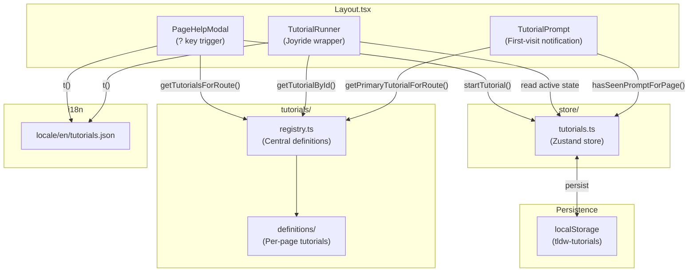

# Tutorial System Developer Guide

This guide explains the per-page tutorial system's architecture, key components, and how to add new tutorials. It targets developers working on user onboarding, feature discovery, and help systems in the WebUI.

## Overview

The Tutorial System provides contextual, page-specific guided tours using React Joyride. Key features include:

- **Per-page tutorials**: Each page can have multiple tutorials covering different aspects
- **First-visit prompts**: Automatic notification for new users on pages with tutorials
- **Help modal**: Unified modal (triggered by `?` key) showing available tutorials and keyboard shortcuts
- **Completion tracking**: Persistent storage of tutorial completion status
- **i18n support**: All tutorial content supports internationalization

## Architecture



## Directory Map

| Path | Purpose |
|------|---------|
| `src/tutorials/` | Tutorial definitions and registry |
| `src/tutorials/registry.ts` | Central registry, types, and helper functions |
| `src/tutorials/definitions/` | Per-page tutorial definition files |
| `src/tutorials/index.ts` | Public exports for the tutorials module |
| `src/store/tutorials.ts` | Zustand store for state management |
| `src/components/Common/PageHelpModal.tsx` | Help modal UI (tutorials + shortcuts) |
| `src/components/Common/TutorialRunner.tsx` | React Joyride wrapper |
| `src/components/Common/TutorialPrompt.tsx` | First-visit notification toast |
| `src/assets/locale/en/tutorials.json` | i18n strings for tutorials |

## Core Components

### 1. Tutorial Registry (`tutorials/registry.ts`)

The registry is the single source of truth for all tutorial definitions. It provides:

- **Type definitions**: `TutorialStep` and `TutorialDefinition` interfaces
- **Central registry**: `TUTORIAL_REGISTRY` array of all tutorials
- **Helper functions**: Route matching and tutorial lookup

```typescript
// Types
interface TutorialStep {
  target: string           // CSS selector or data-testid
  titleKey: string         // i18n key for title
  titleFallback: string    // Fallback if i18n key not found
  contentKey: string       // i18n key for content
  contentFallback: string  // Fallback content
  placement?: Placement    // Tooltip position (auto, top, bottom, etc.)
  disableBeacon?: boolean  // Hide pulsing dot
  spotlightClicks?: boolean // Allow clicks on spotlight
  isFixed?: boolean        // Target is fixed positioned
}

interface TutorialDefinition {
  id: string               // Unique identifier
  routePattern: string     // Route pattern to match
  labelKey: string         // i18n key for tutorial name
  labelFallback: string    // Fallback label
  descriptionKey: string   // i18n key for description
  descriptionFallback: string
  icon?: LucideIcon        // Optional icon
  steps: TutorialStep[]    // Tutorial steps
  prerequisites?: string[] // Required tutorial IDs
  priority?: number        // Sort order (lower = higher)
}
```

### 2. Zustand Store (`store/tutorials.ts`)

Manages all tutorial state with localStorage persistence for completion tracking:

**Persisted State** (survives page refresh):
- `completedTutorials: string[]` - IDs of completed tutorials
- `seenPromptPages: string[]` - Pages where user saw first-visit prompt

**Runtime State** (resets on refresh):
- `activeTutorialId: string | null` - Currently running tutorial
- `activeStepIndex: number` - Current step in active tutorial
- `isHelpModalOpen: boolean` - Help modal visibility

**Convenience Hooks**:
- `useActiveTutorial()` - Active tutorial state and controls
- `useHelpModal()` - Help modal open/close controls
- `useTutorialCompletion()` - Completion tracking

### 3. PageHelpModal (`components/Common/PageHelpModal.tsx`)

Unified help modal triggered by pressing `?`. Features:

- **Two tabs**: Tutorials and Keyboard Shortcuts
- **Route-aware**: Shows only tutorials for current page
- **Completion status**: Visual indicators for completed tutorials
- **Start/replay**: Button to launch or replay tutorials
- **Accessible**: Full keyboard navigation and ARIA labels

### 4. TutorialRunner (`components/Common/TutorialRunner.tsx`)

Wrapper around React Joyride that:

- Converts `TutorialDefinition` to Joyride `Step[]` format
- Applies i18n translations to step content
- Handles step progression and completion callbacks
- Matches app design system styling
- Gracefully handles missing targets

### 5. TutorialPrompt (`components/Common/TutorialPrompt.tsx`)

Shows a toast notification on first visit to pages with tutorials:

- Appears after 2-second delay
- Offers quick start of primary tutorial
- Persists "seen" state to avoid repeated prompts
- Uses Ant Design notification API

## Adding a New Tutorial

Follow this checklist to add a tutorial for a new page:

### Step 1: Create Definition File

Create a new file in `src/tutorials/definitions/`:

```typescript
// src/tutorials/definitions/my-feature.ts
import { BookOpen, Settings } from "lucide-react"
import type { TutorialDefinition } from "../registry"

const myFeatureBasics: TutorialDefinition = {
  id: "my-feature-basics",
  routePattern: "/options/my-feature",
  labelKey: "tutorials:myFeature.basics.label",
  labelFallback: "Getting Started",
  descriptionKey: "tutorials:myFeature.basics.description",
  descriptionFallback: "Learn the basics of My Feature",
  icon: BookOpen,
  priority: 1,
  steps: [
    {
      target: '[data-testid="main-action-button"]',
      titleKey: "tutorials:myFeature.basics.step1Title",
      titleFallback: "Main Action",
      contentKey: "tutorials:myFeature.basics.step1Content",
      contentFallback: "Click here to perform the main action.",
      placement: "bottom",
      disableBeacon: true  // First step typically disables beacon
    },
    {
      target: '[data-testid="settings-panel"]',
      titleKey: "tutorials:myFeature.basics.step2Title",
      titleFallback: "Settings",
      contentKey: "tutorials:myFeature.basics.step2Content",
      contentFallback: "Customize your experience here.",
      placement: "left"
    }
  ]
}

export const myFeatureTutorials: TutorialDefinition[] = [
  myFeatureBasics
]
```

### Step 2: Register in Registry

Add your tutorials to `src/tutorials/registry.ts`:

```typescript
import { myFeatureTutorials } from "./definitions/my-feature"

export const TUTORIAL_REGISTRY: TutorialDefinition[] = [
  ...playgroundTutorials,
  ...myFeatureTutorials  // Add here
]
```

### Step 3: Add i18n Strings

Add translations to `src/assets/locale/en/tutorials.json`:

```json
{
  "myFeature": {
    "basics": {
      "label": "Getting Started",
      "description": "Learn the basics of My Feature",
      "step1Title": "Main Action",
      "step1Content": "Click here to perform the main action.",
      "step2Title": "Settings",
      "step2Content": "Customize your experience here."
    }
  }
}
```

### Step 4: Add data-testid Attributes

Ensure target elements have `data-testid` attributes:

```tsx
// In your component
<button data-testid="main-action-button">
  Do Something
</button>

<div data-testid="settings-panel">
  {/* Settings content */}
</div>
```

### Step 5: Export (Optional)

If you want direct access to your tutorials, export from `src/tutorials/index.ts`:

```typescript
export { myFeatureTutorials } from "./definitions/my-feature"
```

### Verification Checklist

- [ ] Tutorial appears in Help Modal (`?` key) when on the target page
- [ ] All steps have valid targets (check console for warnings)
- [ ] i18n keys resolve correctly (no fallback text showing)
- [ ] Tutorial completes and marks as completed
- [ ] First-visit prompt appears for new users
- [ ] Replay button works for completed tutorials

## Route Pattern Matching

The registry supports flexible route matching:

| Pattern | Matches |
|---------|---------|
| `/options/playground` | Exact match only |
| `/options/*` | Any path under `/options/` |
| `/options/prompt/*` | Any path under `/options/prompt/` |

```typescript
// Examples
routePattern: "/options/playground"     // Exact: /options/playground
routePattern: "/options/media/*"        // Wildcard: /options/media/library, /options/media/search
```

## i18n Integration

### Namespace

All tutorial strings use the `tutorials` namespace:

```typescript
// In components
const { t } = useTranslation(["tutorials", "common"])

// Key format
t("tutorials:playground.basics.label")
```

### Key Conventions

| Key Type | Pattern | Example |
|----------|---------|---------|
| Label | `{page}.{tutorial}.label` | `playground.basics.label` |
| Description | `{page}.{tutorial}.description` | `playground.basics.description` |
| Step Title | `{page}.{tutorial}.{stepName}Title` | `playground.basics.modelTitle` |
| Step Content | `{page}.{tutorial}.{stepName}Content` | `playground.basics.modelContent` |

### Pluralization

Step counts use ICU message format:

```json
{
  "steps": "{count, plural, one {# step} other {# steps}}"
}
```

## Styling

The TutorialRunner applies consistent styling that matches the app's design system:

```typescript
const tutorialStyles = {
  options: {
    primaryColor: "var(--color-primary, #6366f1)",
    textColor: "var(--color-text, #1f2937)",
    backgroundColor: "var(--color-surface, #ffffff)",
    // ...
  }
}
```

Customize individual step appearance using CSS classes on target elements if needed.

## Troubleshooting

| Problem | Cause | Solution |
|---------|-------|----------|
| Tutorial not showing | Route pattern doesn't match | Check `routePattern` against actual URL |
| Step skipped | Target not found | Verify `data-testid` exists and is visible |
| Wrong position | Element layout | Try different `placement` value |
| Prompt not appearing | Already seen | Clear localStorage key `tldw-tutorials` |
| i18n not working | Missing namespace | Ensure `tutorials` namespace is loaded |
| Beacon visible on first step | Default behavior | Set `disableBeacon: true` |

### Debugging

Access the store in browser console:

```javascript
// Get current state
window.__tldw_useTutorialStore.getState()

// Reset all progress
window.__tldw_useTutorialStore.getState().resetProgress()

// Manually start a tutorial
window.__tldw_useTutorialStore.getState().startTutorial('playground-basics')
```

## Best Practices

1. **Keep tutorials focused**: 3-6 steps per tutorial, covering one aspect
2. **Split complex features**: Multiple small tutorials > one long tutorial
3. **Use prerequisites**: Chain tutorials that build on each other
4. **Disable beacon on first step**: Reduces confusion
5. **Provide fallback text**: Always include fallbacks for i18n keys
6. **Test on different screen sizes**: Tooltip placement may vary
7. **Use semantic data-testid**: Descriptive names aid maintenance
8. **Consider fixed elements**: Set `isFixed: true` for sticky/fixed targets

---

For design changes or new features, coordinate with UX and update this guide accordingly.
