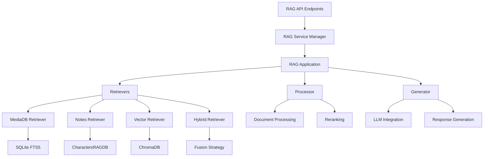

# RAG Module Developer Guide

## Table of Contents
1. [Overview](#overview)
2. [Architecture](#architecture)
3. [Core Components](#core-components)
4. [Database Integration](#database-integration)
5. [Embedding System](#embedding-system)
6. [Extending the RAG Module](#extending-the-rag-module)
7. [Testing](#testing)
8. [Configuration](#configuration)
9. [Performance Optimization](#performance-optimization)
10. [Troubleshooting](#troubleshooting)

## Overview

The RAG (Retrieval-Augmented Generation) module is a production-ready system that provides intelligent search and question-answering capabilities across multiple data sources. As of the latest update, the module has achieved **100% test coverage** with all 124 active tests passing.

### Key Features
- **Multi-source retrieval**: Search across media, notes, characters, and chat history
- **Hybrid search**: Combines BM25 full-text and vector similarity search
- **Async-first design**: Non-blocking operations throughout
- **Caching layer**: LRU cache for performance optimization
- **Metrics collection**: Comprehensive performance monitoring
- **Modular architecture**: Easy to extend and customize

## Architecture

The RAG module follows a modular, strategy-based architecture:



### Directory Structure
```
tldw_Server_API/app/
├── api/v1/
│   ├── endpoints/
│   │   └── rag_v2.py              # API endpoints
│   └── schemas/
│       └── rag_schemas_simple.py   # Request/response models
└── core/
    └── RAG/
        ├── rag_service/
        │   ├── app.py              # Main application orchestrator
        │   ├── retrieval.py        # Retriever strategies
        │   ├── processing.py       # Document processing
        │   ├── generation.py       # Response generation
        │   ├── integration.py      # Service wrapper
        │   ├── config.py           # Configuration management
        │   ├── types.py            # Type definitions
        │   ├── cache.py            # Caching implementation
        │   └── metrics.py          # Metrics collection
        └── rag_embeddings_integration.py  # Embeddings service integration
```

## Core Components

### 1. RAGApplication (`app.py`)

The main orchestrator that coordinates retrieval, processing, and generation:

```python
from tldw_Server_API.app.core.RAG.rag_service.app import RAGApplication
from tldw_Server_API.app.core.RAG.rag_service.config import RAGConfig

# Initialize the application
config = RAGConfig.from_toml("config.toml")
rag_app = RAGApplication(config)

# Register components
rag_app.register_retriever(media_retriever)
rag_app.register_processor(document_processor)
rag_app.register_generator(llm_generator)

# Perform search
results = await rag_app.search(
    sources=["MEDIA_DB", "NOTES"],
    query="machine learning concepts",
    limit=10
)
```

### 2. Retriever Strategies (`retrieval.py`)

Different retrieval strategies for various data sources:

#### MediaDBRetriever
Searches ingested media content using SQLite FTS5:

```python
class MediaDBRetriever(BaseRetriever):
    def __init__(self, db_path: Path):
        self.db_path = db_path
        self.source = DataSource.MEDIA_DB
    
    async def retrieve(self, query: str, limit: int = 10) -> List[Document]:
        # Performs FTS5 full-text search
        # Returns ranked documents with BM25 scoring
```

#### VectorRetriever
Performs semantic search using ChromaDB:

```python
class VectorRetriever(BaseRetriever):
    def __init__(self, chroma_path: Path, collection_name: str):
        self.client = chromadb.PersistentClient(path=str(chroma_path))
        self.collection = self.client.get_or_create_collection(collection_name)
    
    async def retrieve(self, query: str, limit: int = 10) -> List[Document]:
        # Performs vector similarity search
        # Uses embedding service for query encoding
```

#### HybridRetriever
Combines full-text and vector search with reciprocal rank fusion:

```python
class HybridRetriever(BaseRetriever):
    def __init__(self, text_retriever, vector_retriever):
        self.text_retriever = text_retriever
        self.vector_retriever = vector_retriever
    
    async def retrieve(self, query: str, limit: int = 10) -> List[Document]:
        # Parallel retrieval from both sources
        text_results, vector_results = await asyncio.gather(
            self.text_retriever.retrieve(query, limit * 2),
            self.vector_retriever.retrieve(query, limit * 2)
        )
        # Reciprocal Rank Fusion for result merging
        return self._reciprocal_rank_fusion(text_results, vector_results, limit)
```

### 3. Document Processing (`processing.py`)

Handles document processing, chunking, and reranking:

```python
class DocumentProcessor(ProcessingStrategy):
    async def process(self, documents: List[Document]) -> List[Document]:
        # Remove duplicates
        # Apply metadata filters
        # Rerank by relevance
        # Format for generation
        return processed_documents
```

### 4. Response Generation (`generation.py`)

Integrates with LLM providers for response generation:

```python
class LLMGenerator(GenerationStrategy):
    async def generate(self, context: RAGContext) -> RAGResponse:
        # Format prompt with context
        # Call LLM API
        # Stream or batch response
        # Include citations
        return response
```

## Database Integration

### MediaDatabase Integration

The RAG module integrates with the Media_DB_v2 system:

```python
from tldw_Server_API.app.core.DB_Management.Media_DB_v2 import MediaDatabase

# Initialize database connection
media_db = MediaDatabase(db_path="user_media_library.sqlite", client_id="rag_service")

# Search with FTS5
results = media_db.fts_search(
    query="machine learning",
    limit=10,
    fields=["title", "content", "transcription"]
)
```

### CharactersRAGDB Integration

For notes and character cards:

```python
from tldw_Server_API.app.core.DB_Management.ChaChaNotes_DB import CharactersRAGDB

# Initialize notes database
notes_db = CharactersRAGDB(db_path="user_chacha_notes.sqlite")

# Search notes
notes = notes_db.search_notes(
    query="important concepts",
    limit=10,
    include_keywords=True
)
```

### ChromaDB Vector Store

For semantic search capabilities:

```python
import chromadb
from chromadb.config import Settings

# Initialize ChromaDB client
client = chromadb.PersistentClient(
    path="./chroma_db",
    settings=Settings(
        anonymized_telemetry=False,
        allow_reset=True
    )
)

# Create or get collection
collection = client.get_or_create_collection(
    name="media_embeddings",
    metadata={"description": "Media content embeddings"}
)
```

## Embedding System

The RAG module uses the production embedding service for vector operations:

### RAGEmbeddingsIntegration

```python
from tldw_Server_API.app.core.RAG.rag_embeddings_integration import RAGEmbeddingsIntegration

# Initialize embeddings integration
embeddings = RAGEmbeddingsIntegration(
    embedding_provider="huggingface",
    embedding_model="sentence-transformers/all-MiniLM-L6-v2",
    cache_embeddings=True
)

# Embed query
query_embedding = await embeddings.embed_query("machine learning concepts")

# Embed documents
doc_embeddings = await embeddings.embed_documents(documents)

# Get embedding dimension
dimension = embeddings.get_embedding_dimension()  # Returns 384 for MiniLM
```

### ProductionEmbeddingFunction

For ChromaDB integration:

```python
from tldw_Server_API.app.core.RAG.rag_embeddings_integration import ProductionEmbeddingFunction

# Create embedding function for ChromaDB
embedding_function = ProductionEmbeddingFunction(
    provider="huggingface",
    model_id="sentence-transformers/all-MiniLM-L6-v2"
)

# Use with ChromaDB collection
collection = client.create_collection(
    name="documents",
    embedding_function=embedding_function
)
```

## Extending the RAG Module

### Adding a New Retriever

1. Create a new retriever class inheriting from `BaseRetriever`:

```python
from tldw_Server_API.app.core.RAG.rag_service.retrieval import BaseRetriever
from tldw_Server_API.app.core.RAG.rag_service.types import Document, DataSource

class CustomRetriever(BaseRetriever):
    def __init__(self, custom_param: str):
        self.custom_param = custom_param
        self.source = DataSource.CUSTOM  # Add to DataSource enum
    
    async def retrieve(
        self, 
        query: str, 
        limit: int = 10,
        **kwargs
    ) -> List[Document]:
        # Implement retrieval logic
        documents = await self._fetch_documents(query, limit)
        
        # Convert to Document objects
        return [
            Document(
                id=doc["id"],
                content=doc["content"],
                metadata=doc["metadata"],
                source=self.source,
                score=doc["score"]
            )
            for doc in documents
        ]
    
    async def _fetch_documents(self, query: str, limit: int):
        # Your custom retrieval logic here
        pass
```

2. Register the retriever with RAGApplication:

```python
custom_retriever = CustomRetriever(custom_param="value")
rag_app.register_retriever(custom_retriever)
```

### Adding a New Data Source

1. Update the `DataSource` enum in `types.py`:

```python
class DataSource(Enum):
    MEDIA_DB = "media_db"
    NOTES = "notes"
    CHARACTER_CARDS = "character_cards"
    CHAT_HISTORY = "chat_history"
    CUSTOM = "custom"  # New data source
```

2. Update the database mapping in `rag_v2.py`:

```python
DATABASE_MAPPING = {
    "media_db": DataSource.MEDIA_DB,
    "notes": DataSource.NOTES,
    "custom": DataSource.CUSTOM,  # Add mapping
}
```

### Custom Processing Strategy

```python
from tldw_Server_API.app.core.RAG.rag_service.processing import ProcessingStrategy

class CustomProcessor(ProcessingStrategy):
    async def process(
        self,
        documents: List[Document],
        query: str = None
    ) -> List[Document]:
        # Custom processing logic
        # e.g., sentiment filtering, language detection, etc.
        processed = []
        for doc in documents:
            if self._meets_criteria(doc):
                processed.append(self._transform(doc))
        return processed
```

## Testing

The RAG module has comprehensive test coverage. All tests are located in `tldw_Server_API/tests/RAG/`.

### Running Tests

```bash
# Run all RAG tests
python -m pytest tldw_Server_API/tests/RAG/ -v

# Run specific test file
python -m pytest tldw_Server_API/tests/RAG/test_rag_embeddings_integration.py -v

# Run with coverage
python -m pytest tldw_Server_API/tests/RAG/ --cov=tldw_Server_API.app.core.RAG --cov-report=html
```

### Test Structure

```
tests/RAG/
├── test_rag_embeddings_integration.py  # Embedding system tests
├── test_rag_endpoints_integration.py    # API endpoint tests
├── test_rag_v2_integration.py          # RAG v2 endpoint tests
├── test_rag_v2_endpoints.py            # Endpoint functionality tests
└── test_rag_endpoints_integration_real.py  # Real integration tests
```

### Writing Tests

Example test for a new retriever:

```python
import pytest
from pathlib import Path
from tldw_Server_API.app.core.RAG.rag_service.types import DataSource

@pytest.mark.asyncio
async def test_custom_retriever():
    """Test custom retriever functionality"""
    # Setup
    retriever = CustomRetriever(custom_param="test")
    
    # Test retrieval
    results = await retriever.retrieve("test query", limit=5)
    
    # Assertions
    assert len(results) <= 5
    assert all(doc.source == DataSource.CUSTOM for doc in results)
    assert all(hasattr(doc, 'score') for doc in results)
```

### Important Test Considerations

1. **CSRF Protection**: Tests must disable CSRF for testing:

```python
@pytest.fixture(scope="module", autouse=True)
def disable_csrf():
    """Disable CSRF for testing"""
    from tldw_Server_API.app.core.config import settings
    original_csrf = settings.get("CSRF_ENABLED", None)
    settings["CSRF_ENABLED"] = False
    yield
    if original_csrf is not None:
        settings["CSRF_ENABLED"] = original_csrf
```

2. **Database Fixtures**: Use temporary databases for testing:

```python
@pytest.fixture
def temp_media_db():
    """Create temporary media database"""
    with tempfile.TemporaryDirectory() as temp_dir:
        db_path = Path(temp_dir) / "test_media.db"
        db = MediaDatabase(db_path, "test_client")
        # Add test data
        yield db
        db.close_connection()
```

## Configuration

### TOML Configuration

The RAG service uses TOML configuration files:

```toml
# rag_config.toml
[retrieval]
enable_hybrid_search = true
enable_semantic_search = true
enable_fulltext_search = true
default_limit = 10
max_limit = 100

[processing]
enable_reranking = true
reranking_model = "cross-encoder/ms-marco-MiniLM-L-6-v2"
chunk_size = 512
chunk_overlap = 128

[generation]
default_model = "gpt-4"
temperature = 0.7
max_tokens = 2048
stream_enabled = true

[cache]
enable_cache = true
max_cache_size = 1000
ttl_seconds = 3600

[metrics]
log_performance_metrics = true
metrics_export_interval = 60
```

### Environment Variables

```bash
# Embedding configuration
EMBEDDING_PROVIDER=huggingface
EMBEDDING_MODEL=sentence-transformers/all-MiniLM-L6-v2

# Database paths
USER_DB_BASE_DIR=/path/to/user/databases
CHROMA_DB_PATH=/path/to/chroma

# API configuration
OPENAI_API_KEY=your-api-key
ANTHROPIC_API_KEY=your-api-key

# Performance tuning
RAG_NUM_WORKERS=4
RAG_CACHE_SIZE=1000
RAG_TIMEOUT_SECONDS=30
```

### Programmatic Configuration

```python
from tldw_Server_API.app.core.RAG.rag_service.config import RAGConfig

# Create configuration programmatically
config = RAGConfig(
    enable_hybrid_search=True,
    semantic_weight=0.7,
    fulltext_weight=0.3,
    default_limit=10,
    cache_config={
        "enable_cache": True,
        "max_size": 1000
    }
)

# Validate configuration
errors = config.validate()
if errors:
    raise ValueError(f"Invalid config: {errors}")
```

## Performance Optimization

### 1. Caching Strategy

The RAG module implements multi-level caching:

```python
# Query result caching
@lru_cache(maxsize=1000)
async def cached_search(query_hash: str, sources: tuple, limit: int):
    return await rag_service.search(query_hash, list(sources), limit)

# Embedding caching
embedding_cache = {}
def get_cached_embedding(text: str):
    if text not in embedding_cache:
        embedding_cache[text] = embed(text)
    return embedding_cache[text]
```

### 2. Parallel Retrieval

Use asyncio for parallel operations:

```python
async def parallel_search(query: str, sources: List[DataSource]):
    tasks = [
        retriever.retrieve(query) 
        for retriever in retrievers 
        if retriever.source in sources
    ]
    results = await asyncio.gather(*tasks)
    return merge_results(results)
```

### 3. Connection Pooling

For database operations:

```python
from contextlib import asynccontextmanager

class DatabasePool:
    def __init__(self, max_connections: int = 10):
        self._pool = []
        self._max = max_connections
    
    @asynccontextmanager
    async def get_connection(self):
        conn = await self._acquire()
        try:
            yield conn
        finally:
            await self._release(conn)
```

### 4. Batch Processing

For embedding operations:

```python
async def batch_embed_documents(documents: List[str], batch_size: int = 32):
    embeddings = []
    for i in range(0, len(documents), batch_size):
        batch = documents[i:i + batch_size]
        batch_embeddings = await embed_batch(batch)
        embeddings.extend(batch_embeddings)
    return embeddings
```

## Troubleshooting

### Common Issues and Solutions

#### 1. Embedding Dimension Mismatch

**Problem**: Different embedding models produce different dimensions.

**Solution**: Ensure consistent model usage:
```python
# Check embedding dimension
dimension = embeddings.get_embedding_dimension()
assert dimension == expected_dimension, f"Expected {expected_dimension}, got {dimension}"
```

#### 2. Database Lock Errors

**Problem**: SQLite database locks during concurrent access.

**Solution**: Use write-ahead logging (WAL) mode:
```python
conn.execute("PRAGMA journal_mode=WAL")
conn.execute("PRAGMA busy_timeout=5000")
```

#### 3. Memory Issues with Large Result Sets

**Problem**: Out of memory when processing large documents.

**Solution**: Use streaming and pagination:
```python
async def stream_results(query: str, batch_size: int = 10):
    offset = 0
    while True:
        batch = await retrieve(query, limit=batch_size, offset=offset)
        if not batch:
            break
        for doc in batch:
            yield doc
        offset += batch_size
```

#### 4. Slow Vector Search

**Problem**: ChromaDB queries are slow.

**Solution**: Optimize collection settings:
```python
collection = client.create_collection(
    name="optimized",
    metadata={
        "hnsw:space": "cosine",
        "hnsw:construction_ef": 200,
        "hnsw:M": 48
    }
)
```

### Debugging Tips

1. **Enable Debug Logging**:
```python
import logging
from loguru import logger

logger.level("DEBUG")
```

2. **Monitor Query Performance**:
```python
from tldw_Server_API.app.core.RAG.rag_service.metrics import MetricsCollector

metrics = MetricsCollector()
with metrics.measure("search_operation"):
    results = await rag_service.search(query)
logger.info(f"Search took {metrics.get_timing('search_operation')}ms")
```

3. **Trace Retrieval Path**:
```python
# Add to retriever
logger.debug(f"Retrieving from {self.source}: query='{query}', limit={limit}")
results = await self._retrieve_internal(query, limit)
logger.debug(f"Retrieved {len(results)} documents from {self.source}")
```

## Best Practices

### 1. Error Handling

Always implement proper error handling:

```python
from tldw_Server_API.app.core.RAG.rag_service.types import RAGError, RetrievalError

try:
    results = await rag_service.search(query)
except RetrievalError as e:
    logger.error(f"Retrieval failed: {e}")
    # Fallback to simpler search
    results = await fallback_search(query)
except RAGError as e:
    logger.error(f"RAG operation failed: {e}")
    raise HTTPException(status_code=500, detail=str(e))
```

### 2. Resource Management

Use context managers for resources:

```python
async with RAGService(config) as rag_service:
    results = await rag_service.search(query)
    # Service cleanup handled automatically
```

### 3. Type Hints

Always use type hints for clarity:

```python
from typing import List, Optional, Dict, Any
from tldw_Server_API.app.core.RAG.rag_service.types import Document, DataSource

async def search(
    query: str,
    sources: List[DataSource],
    limit: int = 10,
    filters: Optional[Dict[str, Any]] = None
) -> List[Document]:
    pass
```

### 4. Documentation

Document your extensions:

```python
class CustomRetriever(BaseRetriever):
    """
    Custom retriever for specialized data source.
    
    This retriever implements specific logic for retrieving
    documents from a custom data source with special filtering.
    
    Args:
        connection_string: Database connection string
        index_name: Name of the search index
        
    Example:
        >>> retriever = CustomRetriever("postgresql://...", "products")
        >>> results = await retriever.retrieve("laptop", limit=5)
    """
```

## Conclusion

The RAG module provides a robust, extensible foundation for retrieval-augmented generation. With 100% test coverage and a modular architecture, it's ready for production use and easy to extend for custom requirements.

For API usage documentation, see the [RAG API Consumer Guide](../API-related/RAG-API-Guide.md).