# Embeddings System Documentation

## Table of Contents
1. [System Overview](#system-overview)
2. [Architecture](#architecture)
3. [System Selection Guide](#system-selection-guide)
4. [Components](#components)
5. [Data Flow](#data-flow)
6. [Deployment Options](#deployment-options)
7. [Monitoring & Operations](#monitoring--operations)

## System Overview

The tldw_server Embeddings System provides a comprehensive solution for generating text embeddings through multiple providers. The system offers two distinct architectures to accommodate different use cases:

1. **Synchronous API** (`embeddings_v5_production.py`) - Direct request-response model ideal for single users and small deployments
2. **Job-Based System** (Worker Architecture) - Distributed, queue-based processing for enterprise and multi-tenant deployments

### Key Features
- 🌐 Multi-provider support (OpenAI, HuggingFace, Cohere, Google, Mistral, etc.)
- ⚡ High-performance caching with TTL
- 🔄 Automatic retry logic with circuit breakers
- 📊 Comprehensive monitoring and metrics
- 🔒 Security-first design with proper authorization
- 🎯 Production-ready with extensive testing

## Architecture

### Overall System Architecture

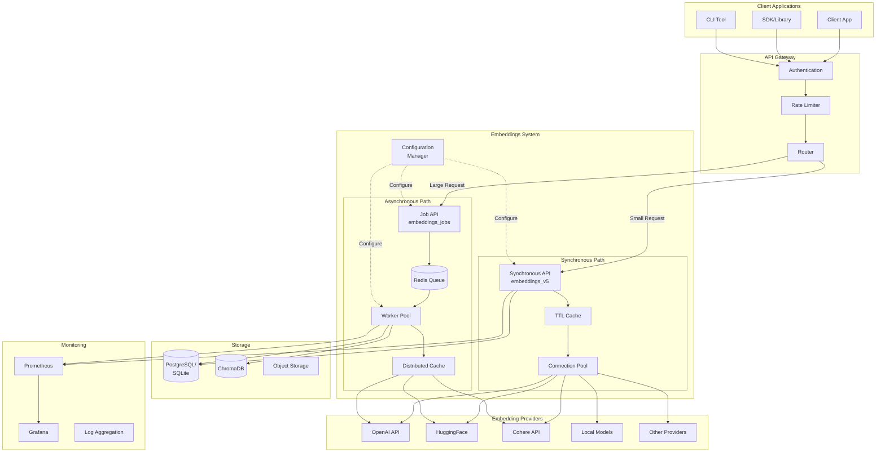

### Synchronous System Architecture

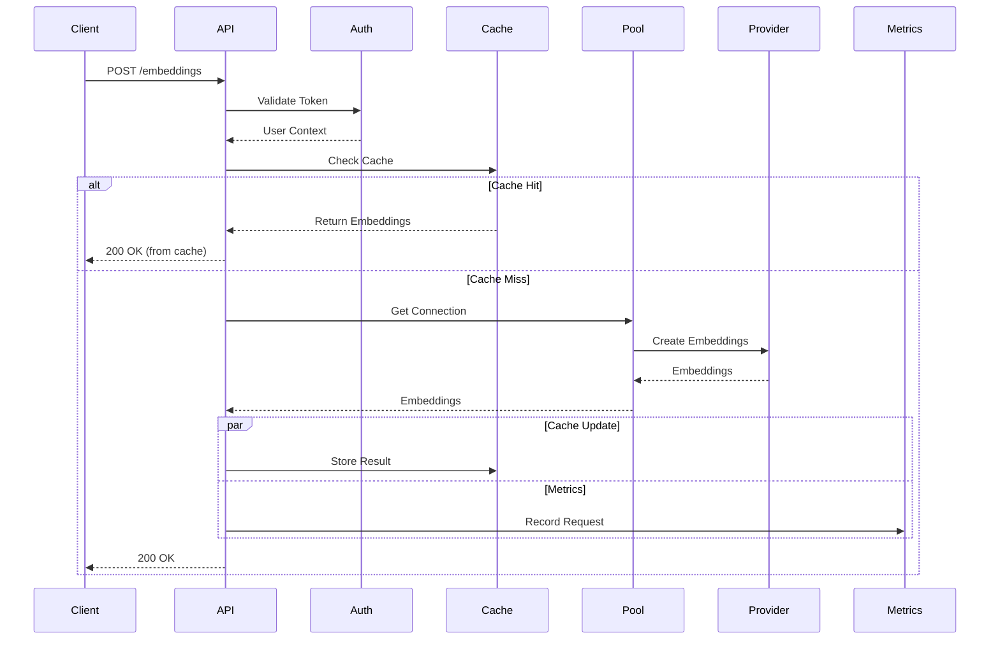

### Job-Based System Architecture

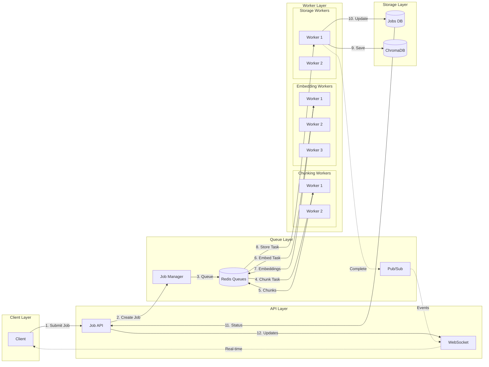

## System Selection Guide

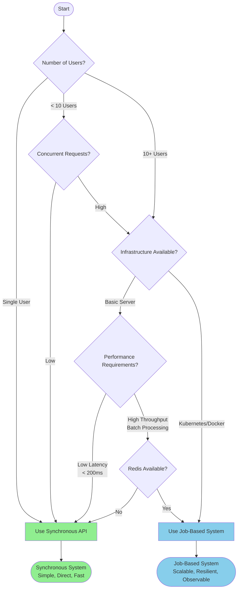

## Components

### Core Components

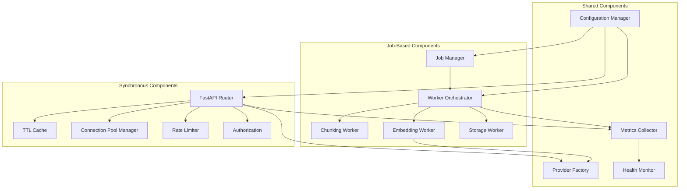

### Cache Lifecycle

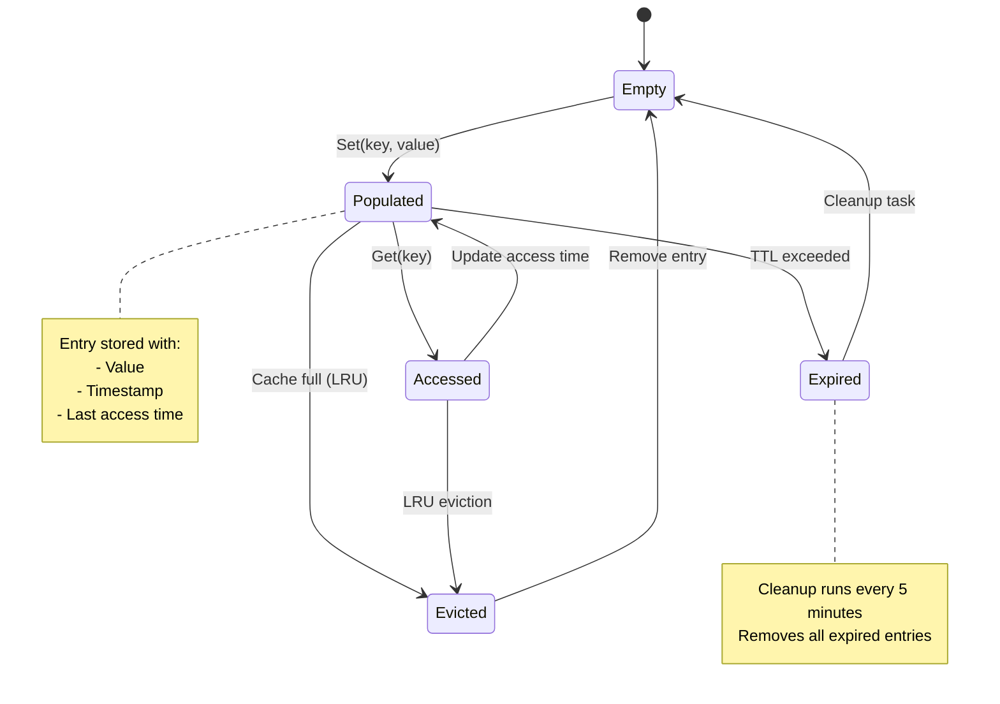

## Data Flow

### Request Processing Flow

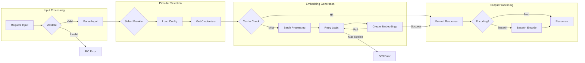

### Error Handling Flow

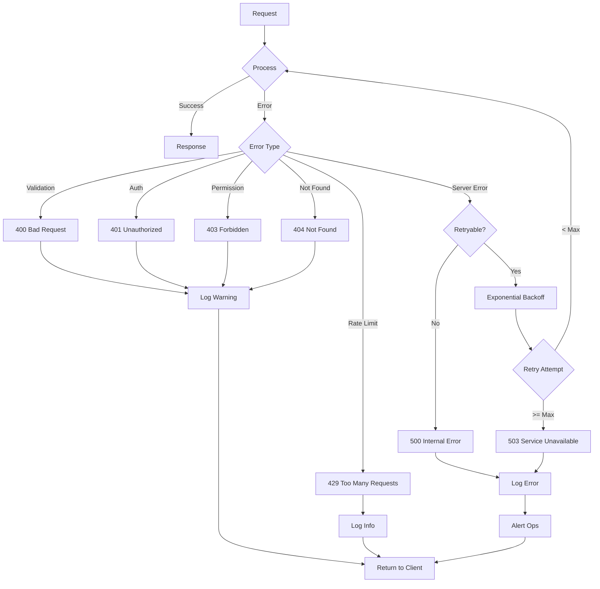

## Deployment Options

### Deployment Architecture Comparison

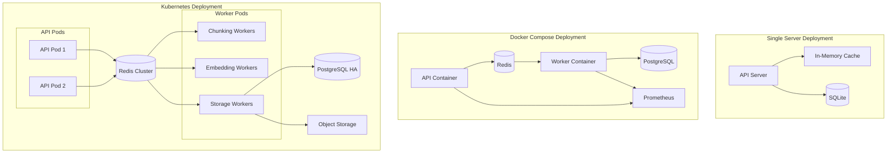

## Monitoring & Operations

### Metrics Collection Flow

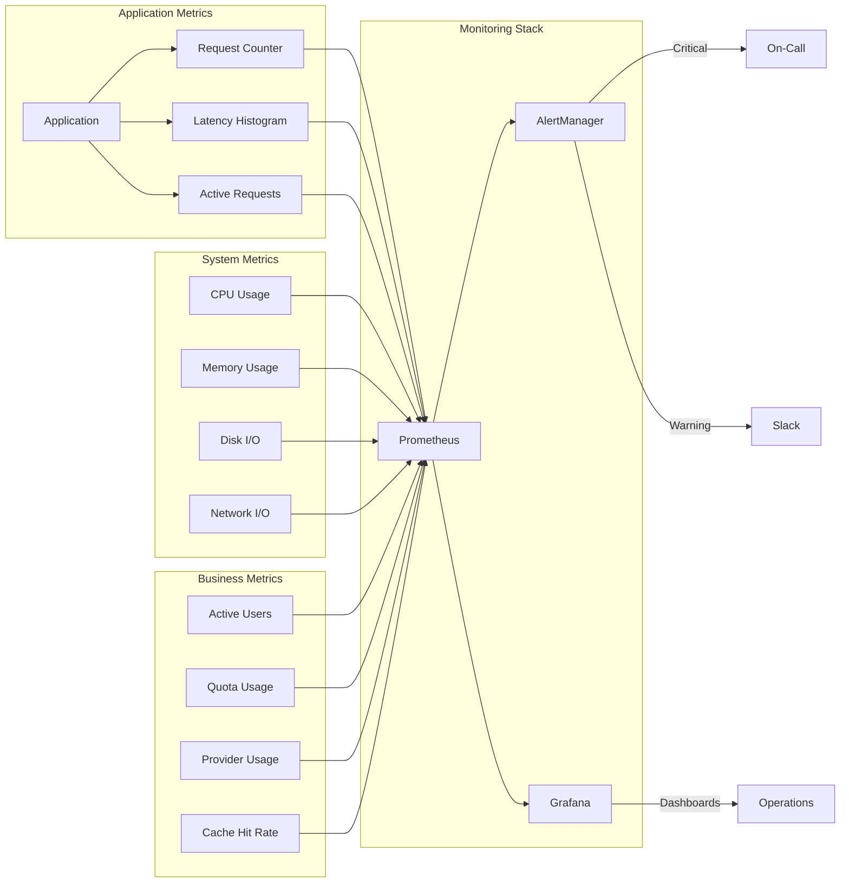

### Health Check System

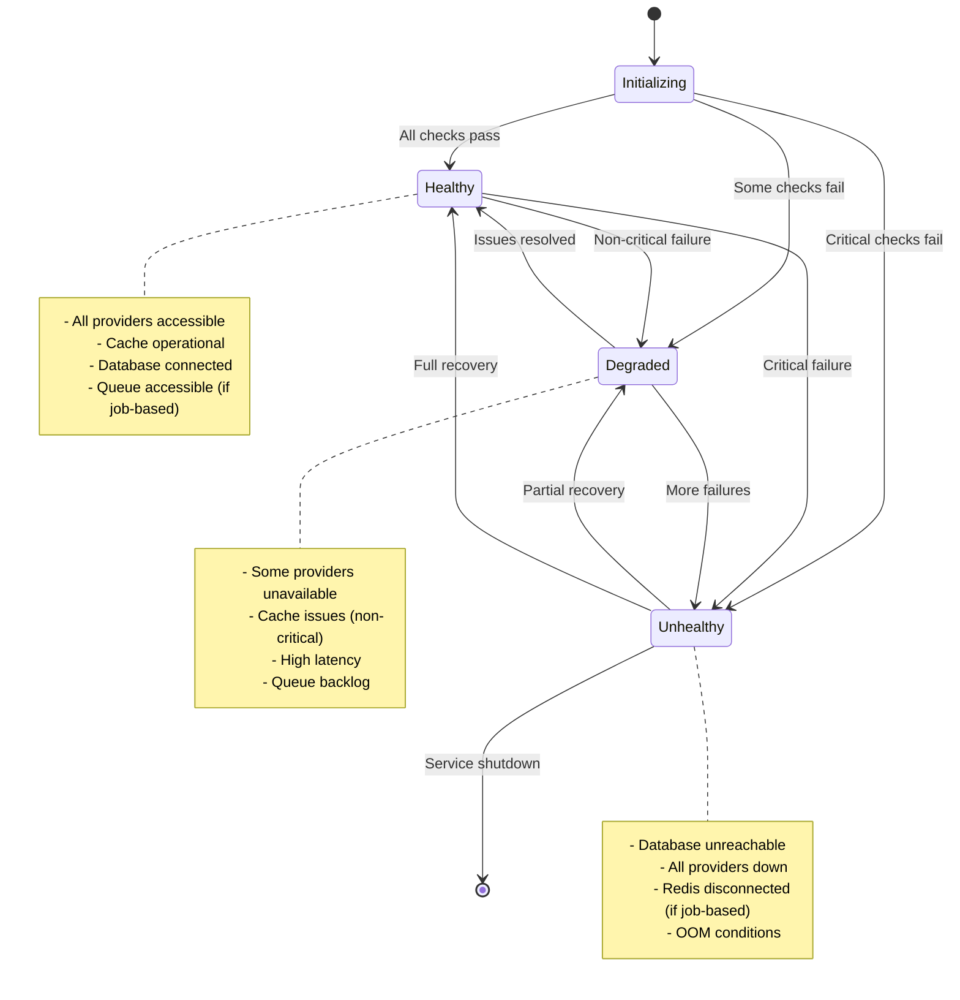

## Security Model

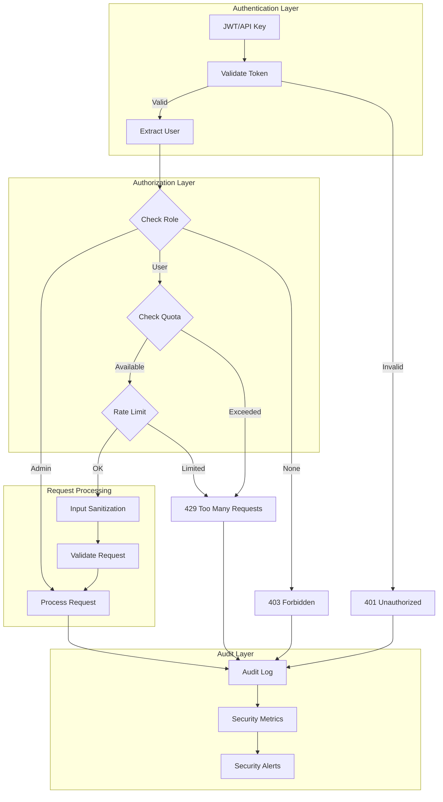

## Performance Optimization

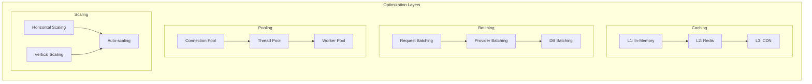

---

## Next Steps

For detailed implementation guidance, see:
- [Developer Guide](./Embeddings-Developer-Guide.md) - For developers working on the codebase
- [API Consumer Guide](./Embeddings-API-Guide.md) - For users consuming the API

For specific deployment scenarios, refer to:
- [Single Server Setup](../Deployment/single-server.md)
- [Docker Compose Setup](../Deployment/docker-compose.md)
- [Kubernetes Deployment](../Deployment/kubernetes.md)