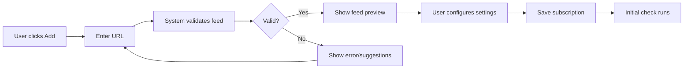
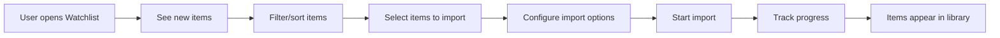
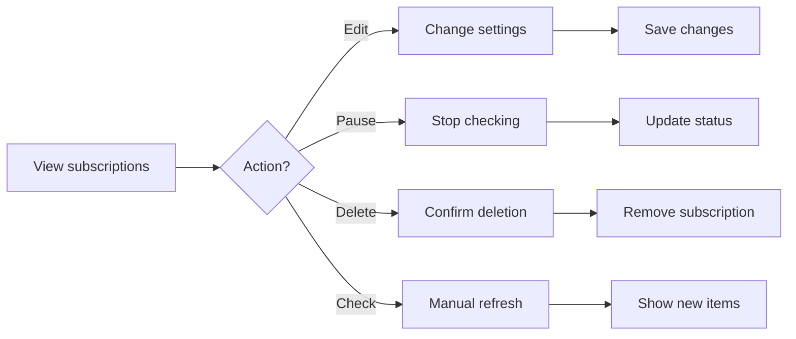

# UI Mockups and User Experience Design

## Overview

This document presents the user interface concepts and workflows for the Subscriptions/Watchlist feature. The design focuses on simplicity, efficiency, and integration with the existing tldw_server interface patterns.

## UI Components

### 1. Main Subscriptions View

```
┌─────────────────────────────────────────────────────────────────────┐
│ 📋 Subscriptions                                    [+ Add] [Import] │
├─────────────────────────────────────────────────────────────────────┤
│ [All] [Active] [Paused] [Failed]          Search: [_______________] │
├─────────────────────────────────────────────────────────────────────┤
│                                                                     │
│ ┌─────────────────────────────────────────────────────────────┐   │
│ │ 🎥 Tech Talks Channel              ⚡ Active    [⋮ Actions]  │   │
│ │ YouTube Channel • Checks every 1 hour                       │   │
│ │ Last checked: 10 minutes ago • 5 new items                  │   │
│ │ Total: 234 items • Imported: 45                             │   │
│ └─────────────────────────────────────────────────────────────┘   │
│                                                                     │
│ ┌─────────────────────────────────────────────────────────────┐   │
│ │ 📰 AI Research Blog                ⚡ Active    [⋮ Actions]  │   │
│ │ RSS Feed • Checks every 3 hours                             │   │
│ │ Last checked: 2 hours ago • No new items                    │   │
│ │ Total: 156 items • Imported: 23                             │   │
│ └─────────────────────────────────────────────────────────────┘   │
│                                                                     │
│ ┌─────────────────────────────────────────────────────────────┐   │
│ │ 🎙️ Data Science Podcast            ⏸️ Paused    [⋮ Actions]  │   │
│ │ Podcast RSS • Checks every 6 hours                          │   │
│ │ Last checked: 3 days ago • Paused by user                   │   │
│ │ Total: 89 episodes • Imported: 12                           │   │
│ └─────────────────────────────────────────────────────────────┘   │
│                                                                     │
│ ┌─────────────────────────────────────────────────────────────┐   │
│ │ 📺 Tutorial Playlist                ❌ Failed    [⋮ Actions]  │   │
│ │ YouTube Playlist • Checks every 12 hours                    │   │
│ │ Last checked: Failed 5 times • Click to view error          │   │
│ │ Total: 45 videos • Imported: 8                              │   │
│ └─────────────────────────────────────────────────────────────┘   │
│                                                                     │
└─────────────────────────────────────────────────────────────────────┘
```

**Actions Menu:**
- Check Now
- View Items
- Edit Settings
- View History
- Pause/Resume
- Delete

### 2. Add Subscription Dialog

```
┌─────────────────────────────────────────────────────────────────────┐
│ ➕ Add Subscription                                            [X] │
├─────────────────────────────────────────────────────────────────────┤
│                                                                     │
│ URL *                                                               │
│ ┌─────────────────────────────────────────────────────────────┐   │
│ │ https://example.com/feed.rss                                │   │
│ └─────────────────────────────────────────────────────────────┘   │
│ 💡 Supports: RSS, Atom, YouTube channels/playlists, Podcasts       │
│                                                                     │
│ [🔍 Validate Feed]  ✓ Valid RSS feed detected                      │
│                                                                     │
│ Name (optional)                                                     │
│ ┌─────────────────────────────────────────────────────────────┐   │
│ │ Example Blog                                                 │   │
│ └─────────────────────────────────────────────────────────────┘   │
│                                                                     │
│ Check Interval                                                      │
│ [Every hour ▼]  [Every 3 hours] [Every 6 hours] [Daily] [Custom]  │
│                                                                     │
│ ⚙️ Advanced Settings                                          [▼]   │
│ ┌─────────────────────────────────────────────────────────────┐   │
│ │ □ Auto-import new items                                      │   │
│ │ □ Only import items matching rules                           │   │
│ │                                                               │   │
│ │ Tags: [tech] [blog] [+]                                      │   │
│ │                                                               │   │
│ │ Import Rules:                                          [Add] │   │
│ │ • Keywords contain "AI" or "machine learning"                │   │
│ │ • Published within last 30 days                              │   │
│ └─────────────────────────────────────────────────────────────┘   │
│                                                                     │
│                                          [Cancel] [Add Subscription]│
└─────────────────────────────────────────────────────────────────────┘
```

### 3. Watchlist View (New Items)

```
┌─────────────────────────────────────────────────────────────────────┐
│ 👁️ Watchlist - 23 New Items            [Import Selected] [Settings]│
├─────────────────────────────────────────────────────────────────────┤
│ Filter: [All Sources ▼] [All Types ▼] [Last 7 days ▼]    [Clear]  │
├─────────────────────────────────────────────────────────────────────┤
│                                                                     │
│ □ Select All                                 23 items selected      │
│                                                                     │
│ ┌─────────────────────────────────────────────────────────────┐   │
│ │ ☑️ 🎥 Building Scalable APIs with FastAPI                    │   │
│ │    From: Tech Talks Channel • 2 hours ago • 45 min          │   │
│ │    Learn how to build production-ready APIs using FastAPI... │   │
│ │    [Preview] [View on YouTube] [Import Options]              │   │
│ └─────────────────────────────────────────────────────────────┘   │
│                                                                     │
│ ┌─────────────────────────────────────────────────────────────┐   │
│ │ ☑️ 📰 Understanding Transformer Architecture                 │   │
│ │    From: AI Research Blog • 5 hours ago • 8 min read        │   │
│ │    A deep dive into the transformer architecture that...     │   │
│ │    Matches rule: "Keywords: AI"                              │   │
│ │    [Preview] [View Original] [Import Options]                │   │
│ └─────────────────────────────────────────────────────────────┘   │
│                                                                     │
│ ┌─────────────────────────────────────────────────────────────┐   │
│ │ □ 🎙️ Episode 45: Data Engineering Best Practices            │   │
│ │    From: Data Science Podcast • 1 day ago • 67 min          │   │
│ │    Interview with leading data engineers discussing...       │   │
│ │    [Preview] [Listen] [Import Options]                       │   │
│ └─────────────────────────────────────────────────────────────┘   │
│                                                                     │
│ Bulk Actions: [Mark as Read] [Skip Selected] [Apply Rules]         │
└─────────────────────────────────────────────────────────────────────┘
```

### 4. Subscription Details View

```
┌─────────────────────────────────────────────────────────────────────┐
│ 🎥 Tech Talks Channel                               [Edit] [Delete]│
├─────────────────────────────────────────────────────────────────────┤
│ Overview | Items | History | Settings                               │
├─────────────────────────────────────────────────────────────────────┤
│                                                                     │
│ 📊 Statistics                                                       │
│ ┌─────────────────────────────────────────────────────────────┐   │
│ │ Status: Active ✓           Last Check: 10 minutes ago        │   │
│ │ Total Items: 234           New Items: 5                      │   │
│ │ Imported: 45 (19%)         Skipped: 189                      │   │
│ │ Check Interval: 1 hour     Next Check: in 50 minutes         │   │
│ │ Success Rate: 98%          Avg Check Time: 2.3s              │   │
│ └─────────────────────────────────────────────────────────────┘   │
│                                                                     │
│ 📈 Activity Chart (Last 7 Days)                                     │
│ ┌─────────────────────────────────────────────────────────────┐   │
│ │     New Items Found                                          │   │
│ │ 10 ┤                                                         │   │
│ │  8 ┤    ██                                                  │   │
│ │  6 ┤ ██ ██ ██                                               │   │
│ │  4 ┤ ██ ██ ██    ██                                         │   │
│ │  2 ┤ ██ ██ ██ ██ ██ ██                                      │   │
│ │  0 └─────────────────────────────────────────               │   │
│ │     Mon Tue Wed Thu Fri Sat Sun                             │   │
│ └─────────────────────────────────────────────────────────────┘   │
│                                                                     │
│ 🏷️ Tags: [YouTube] [Tech] [Tutorials]                              │
│                                                                     │
│ [Check Now] [View All Items] [View New Items] [Pause Subscription] │
└─────────────────────────────────────────────────────────────────────┘
```

### 5. Import Options Dialog

```
┌─────────────────────────────────────────────────────────────────────┐
│ 📥 Import Options                                              [X] │
├─────────────────────────────────────────────────────────────────────┤
│                                                                     │
│ Importing: "Building Scalable APIs with FastAPI"                   │
│                                                                     │
│ Processing Options:                                                 │
│ ☑️ Download video/audio                                             │
│ ☑️ Generate transcript                                              │
│ ☑️ Create chunks for analysis                                       │
│ ☑️ Generate embeddings                                              │
│ □ Summarize content                                                │
│                                                                     │
│ Quality Settings:                                                   │
│ Video: [720p ▼]  Audio: [Medium ▼]                                │
│                                                                     │
│ Metadata:                                                           │
│ ☑️ Preserve original publish date                                   │
│ ☑️ Include source subscription info                                 │
│ ☑️ Copy subscription tags                                           │
│                                                                     │
│ Additional Tags: [_______________] [Add]                            │
│                                                                     │
│                                      [Cancel] [Import with Options] │
└─────────────────────────────────────────────────────────────────────┘
```

### 6. Mobile-Responsive Design

```
┌─────────────────────┐
│ 📋 Subscriptions    │
│ ┌─────────────────┐ │
│ │ 🎥 Tech Channel │ │
│ │ 5 new items     │ │
│ │ [View] [Check]  │ │
│ └─────────────────┘ │
│ ┌─────────────────┐ │
│ │ 📰 AI Blog      │ │
│ │ No new items    │ │
│ │ [View] [Check]  │ │
│ └─────────────────┘ │
│                     │
│ [+ Add] [Watchlist] │
└─────────────────────┘
```

## User Workflows

### Workflow 1: Adding a New Subscription



### Workflow 2: Reviewing New Items



### Workflow 3: Managing Subscriptions



## Interactive Elements

### 1. Drag and Drop Support
- Drag OPML files to import multiple subscriptions
- Drag items between categories
- Reorder subscription priority

### 2. Keyboard Shortcuts
- `N` - Add new subscription
- `W` - Open watchlist
- `R` - Refresh all subscriptions
- `Space` - Select/deselect item
- `Enter` - Import selected items
- `?` - Show keyboard shortcuts

### 3. Real-time Updates
- Live progress during checks
- New item notifications
- Status updates without refresh
- Background import progress

### 4. Smart Suggestions
- Suggest check intervals based on feed activity
- Recommend related subscriptions
- Auto-complete for known feed URLs
- Smart tagging based on content

## Accessibility Features

### 1. Screen Reader Support
- Semantic HTML structure
- ARIA labels for all interactive elements
- Keyboard navigation for all features
- Status announcements

### 2. Visual Accessibility
- High contrast mode support
- Configurable text size
- Color-blind friendly indicators
- Focus indicators

### 3. Reduced Motion
- Respect prefers-reduced-motion
- Option to disable animations
- Simple transitions

## Integration Points

### 1. Main Navigation
```
Media Library | Subscriptions | Chat | Notes | Settings
                    ↑
              New section
```

### 2. Quick Actions
- Add subscription from any URL
- Import from browser extension
- Share subscription lists
- Export to OPML

### 3. Notifications
- New items badge on icon
- Optional email digests
- Push notifications (future)
- In-app notification center

## Configuration Options

### User Preferences
```json
{
  "subscriptions": {
    "default_check_interval": 3600,
    "auto_import": false,
    "show_thumbnails": true,
    "items_per_page": 20,
    "default_import_options": {
      "download": true,
      "transcribe": true,
      "chunk": true,
      "embed": false
    },
    "notifications": {
      "new_items": true,
      "check_failures": true,
      "import_complete": true
    }
  }
}
```

## Future UI Enhancements

### 1. Advanced Features
- Subscription recommendations
- Duplicate detection UI
- Bulk editing interface
- Advanced filtering builder

### 2. Visualization
- Subscription network graph
- Content timeline view
- Topic clustering
- Trend analysis

### 3. Collaboration
- Share subscriptions
- Team watchlists
- Collaborative filtering
- Comments on items

### 4. Mobile App
- Native mobile experience
- Offline watchlist
- Background sync
- Push notifications
