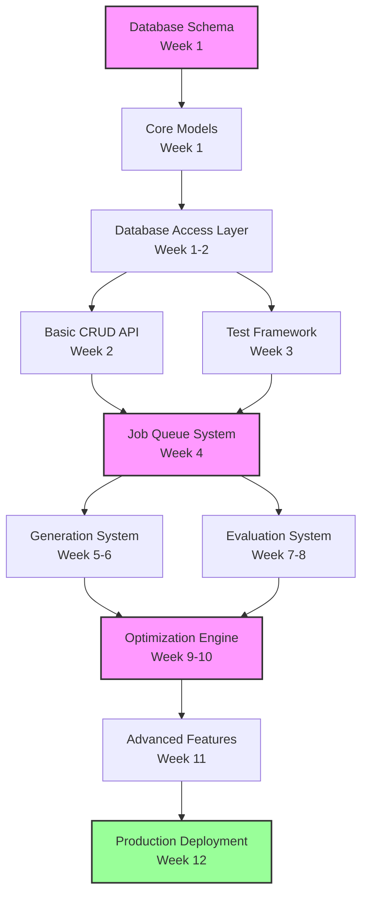

# Prompt Studio Implementation Plan V2 (Revised)

## Executive Summary
A 12-week phased implementation plan (with 20% buffer) for building a production-ready prompt studio that integrates seamlessly with the existing tldw_server infrastructure.

## Critical Path & Dependencies



### Legend:
- 🔴 Critical Path Items (pink)
- 🟢 Milestone (green)
- Dependencies shown with arrows

## Timeline with Buffer

| Phase | Original | With 20% Buffer | Dependencies |
|-------|----------|----------------|--------------|
| Foundation | 2 weeks | 2.5 weeks | None |
| Test Framework | 2 weeks | 2.5 weeks | Foundation |
| Generation | 2 weeks | 2.5 weeks | Test Framework |
| Evaluation | 2 weeks | 2.5 weeks | Test Framework |
| Optimization | 2 weeks | 2.5 weeks | Generation + Evaluation |
| Production | 2 weeks | 2 weeks | All above |
| **Total** | **10 weeks** | **12 weeks** | - |

## Phase 1: Foundation & Infrastructure (Weeks 1-2)

### Week 1: Database and Core Models

#### Day 1-2: Database Schema Implementation
**Files to Create:**
```
app/core/DB_Management/migrations/001_prompt_studio_schema.sql
app/core/DB_Management/migrations/002_prompt_studio_indexes.sql
app/core/DB_Management/migrations/003_prompt_studio_triggers.sql
app/core/DB_Management/migrations/004_prompt_studio_fts.sql
```

**Tasks:**
- [ ] Create migration scripts with proper schema
- [ ] Add all necessary indexes
- [ ] Implement sync_log triggers
- [ ] Set up FTS tables
- [ ] Test migration rollback/forward

#### Day 3-4: Pydantic Models and Schemas
**Files to Create:**
```
app/api/v1/schemas/prompt_studio_base.py
app/api/v1/schemas/prompt_studio_project.py
app/api/v1/schemas/prompt_studio_test.py
app/api/v1/schemas/prompt_studio_optimization.py
```

**Tasks:**
- [ ] Define base models with validation
- [ ] Create request/response schemas
- [ ] Add custom validators for complex fields
- [ ] Implement schema documentation

#### Day 5: Database Access Layer
**Files to Create:**
```
app/core/DB_Management/PromptStudioDatabase.py
app/core/DB_Management/prompt_studio_queries.py
```

**Tasks:**
- [ ] Extend PromptsDatabase class
- [ ] Implement connection management
- [ ] Add transaction helpers
- [ ] Create query builders

### Week 2: Core API and Authentication

#### Day 1-2: Authentication and Dependencies
**Files to Create:**
```
app/api/v1/API_Deps/prompt_studio_deps.py
app/core/AuthNZ/prompt_studio_permissions.py
```

**Tasks:**
- [ ] Implement user context injection
- [ ] Add permission checking
- [ ] Create rate limiting decorators
- [ ] Set up client_id tracking

#### Day 3-4: Basic CRUD Endpoints
**Files to Create:**
```
app/api/v1/endpoints/prompt_studio_projects.py
app/api/v1/endpoints/prompt_studio_prompts.py
```

**Tasks:**
- [ ] Implement project CRUD
- [ ] Add prompt versioning
- [ ] Create list with pagination
- [ ] Add soft delete support

#### Day 5: Initial Testing Suite
**Files to Create:**
```
tests/prompt_studio/test_database.py
tests/prompt_studio/test_schemas.py
tests/prompt_studio/test_crud_api.py
tests/prompt_studio/conftest.py
```

**Tasks:**
- [ ] Set up test fixtures
- [ ] Write database tests
- [ ] Add API integration tests
- [ ] Create test data generators

## Phase 2: Test Framework & Job System (Weeks 3-4)

### Week 3: Test Case Management

#### Day 1-2: Test Case CRUD
**Files to Create:**
```
app/core/Prompt_Management/prompt_studio/test_case_manager.py
app/api/v1/endpoints/prompt_studio_test_cases.py
```

**Tasks:**
- [ ] Implement test case CRUD operations
- [ ] Add tagging system
- [ ] Create golden test set management
- [ ] Implement test case search

#### Day 3: Import/Export System
**Files to Create:**
```
app/core/Prompt_Management/prompt_studio/test_case_io.py
app/core/Prompt_Management/prompt_studio/csv_handler.py
```

**Tasks:**
- [ ] CSV import with validation
- [ ] JSON import/export
- [ ] Batch import handling
- [ ] Export templates

#### Day 4-5: Test Case Generation
**Files to Create:**
```
app/core/Prompt_Management/prompt_studio/test_case_generator.py
app/core/Prompt_Management/prompt_studio/generation_strategies.py
```

**Tasks:**
- [ ] Auto-generation from descriptions
- [ ] Generate from existing data
- [ ] Implement generation strategies
- [ ] Add quality validation

### Week 4: Job Queue and Background Processing

#### Day 1-2: Job Queue Infrastructure
**Files to Create:**
```
app/services/prompt_studio_worker.py
app/core/Prompt_Management/prompt_studio/job_manager.py
app/core/Prompt_Management/prompt_studio/job_processor.py
```

**Tasks:**
- [ ] Set up job queue table operations
- [ ] Implement job scheduling
- [ ] Add retry logic
- [ ] Create job monitoring

#### Day 3-4: WebSocket/SSE for Updates
**Files to Create:**
```
app/api/v1/endpoints/prompt_studio_websocket.py
app/core/Prompt_Management/prompt_studio/event_manager.py
```

**Tasks:**
- [ ] WebSocket endpoint setup
- [ ] Event broadcasting system
- [ ] Connection management
- [ ] Fallback to polling

#### Day 5: Job System Testing
**Files to Create:**
```
tests/prompt_studio/test_job_queue.py
tests/prompt_studio/test_websocket.py
```

**Tasks:**
- [ ] Test job processing
- [ ] Test retry mechanisms
- [ ] WebSocket integration tests
- [ ] Load testing setup

## Phase 3: Generation & Evaluation (Weeks 5-6)

### Week 5: Prompt Generation System

#### Day 1-2: Basic Generator
**Files to Create:**
```
app/core/Prompt_Management/prompt_studio/prompt_generator.py
app/core/Prompt_Management/prompt_studio/generation_templates.py
```

**Tasks:**
- [ ] Integrate with existing generator
- [ ] Add template system
- [ ] Implement role setting
- [ ] Add CoT generation

#### Day 3-4: Prompt Improver
**Files to Create:**
```
app/core/Prompt_Management/prompt_studio/prompt_improver.py
app/core/Prompt_Management/prompt_studio/improvement_strategies.py
```

**Tasks:**
- [ ] Analyze existing prompts
- [ ] Apply improvement techniques
- [ ] XML standardization
- [ ] Track improvements

#### Day 5: Generation API Integration
**Files to Create:**
```
app/api/v1/endpoints/prompt_studio_generation.py
tests/prompt_studio/test_generation.py
```

**Tasks:**
- [ ] Wire up generation endpoints
- [ ] Add async generation
- [ ] Implement caching
- [ ] Add generation tests

### Week 6: Evaluation System

#### Day 1-2: Test Execution Framework
**Files to Create:**
```
app/core/Prompt_Management/prompt_studio/test_runner.py
app/core/Prompt_Management/prompt_studio/execution_engine.py
```

**Tasks:**
- [ ] Single test execution
- [ ] Batch test processing
- [ ] Parallel execution
- [ ] Result aggregation

#### Day 3-4: Integration with Existing Evaluators
**Files to Create:**
```
app/core/Prompt_Management/prompt_studio/evaluation_adapter.py
app/core/Prompt_Management/prompt_studio/metrics_calculator.py
```

**Tasks:**
- [ ] Connect to G-Eval
- [ ] Connect to RAG evaluator
- [ ] Custom metric support
- [ ] Score normalization

#### Day 5: Evaluation API and Testing
**Files to Create:**
```
app/api/v1/endpoints/prompt_studio_evaluation.py
tests/prompt_studio/test_evaluation.py
```

**Tasks:**
- [ ] Evaluation endpoints
- [ ] Results API
- [ ] Comparison endpoints
- [ ] Integration tests

## Phase 4: Optimization Engine (Weeks 7-8)

### Week 7: Basic Optimization

#### Day 1-2: Bootstrap System
**Files to Create:**
```
app/core/Prompt_Management/prompt_studio/bootstrap_manager.py
app/core/Prompt_Management/prompt_studio/example_selector.py
```

**Tasks:**
- [ ] Trace collection
- [ ] Example extraction
- [ ] Quality filtering
- [ ] Example ranking

#### Day 3-4: Simple Optimizer
**Files to Create:**
```
app/core/Prompt_Management/prompt_studio/basic_optimizer.py
app/core/Prompt_Management/prompt_studio/optimization_strategies.py
```

**Tasks:**
- [ ] Hill climbing implementation
- [ ] Random search
- [ ] Grid search
- [ ] Early stopping

#### Day 5: Optimization Tracking
**Files to Create:**
```
app/core/Prompt_Management/prompt_studio/optimization_tracker.py
tests/prompt_studio/test_optimization.py
```

**Tasks:**
- [ ] Track iterations
- [ ] Store intermediate results
- [ ] Convergence detection
- [ ] Rollback support

### Week 8: Advanced Optimization

#### Day 1-2: MIPRO Implementation
**Files to Create:**
```
app/core/Prompt_Management/prompt_studio/mipro_optimizer.py
app/core/Prompt_Management/prompt_studio/surrogate_model.py
```

**Tasks:**
- [ ] Instruction proposal
- [ ] Discrete search
- [ ] Surrogate modeling
- [ ] Multi-objective support

#### Day 3-4: Module System
**Files to Create:**
```
app/core/Prompt_Management/prompt_studio/prompt_modules.py
app/core/Prompt_Management/prompt_studio/module_library.py
```

**Tasks:**
- [ ] Define module interface
- [ ] Implement core modules (CoT, ReAct)
- [ ] Module composition
- [ ] Module optimization

#### Day 5: Cost Analysis
**Files to Create:**
```
app/core/Prompt_Management/prompt_studio/cost_analyzer.py
app/core/Prompt_Management/prompt_studio/token_counter.py
```

**Tasks:**
- [ ] Token counting
- [ ] Cost estimation
- [ ] Budget enforcement
- [ ] Cost optimization

## Phase 5: Production & Polish (Weeks 9-10)

### Week 9: Advanced Features

#### Day 1-2: Comparison System
**Files to Create:**
```
app/core/Prompt_Management/prompt_studio/comparator.py
app/api/v1/endpoints/prompt_studio_comparison.py
```

**Tasks:**
- [ ] Side-by-side comparison
- [ ] Diff visualization
- [ ] Statistical testing
- [ ] Report generation

#### Day 3-4: Export/Import System
**Files to Create:**
```
app/core/Prompt_Management/prompt_studio/project_exporter.py
app/core/Prompt_Management/prompt_studio/migration_tools.py
```

**Tasks:**
- [ ] Full project export
- [ ] Prompt migration tools
- [ ] Backup system
- [ ] Version compatibility

#### Day 5: Performance Optimization
**Tasks:**
- [ ] Query optimization
- [ ] Caching implementation
- [ ] Connection pooling
- [ ] Batch processing improvements

### Week 10: Deployment & Documentation

#### Day 1-2: Security Hardening
**Files to Create:**
```
app/core/Prompt_Management/prompt_studio/security.py
app/core/Prompt_Management/prompt_studio/sandbox.py
```

**Tasks:**
- [ ] Input sanitization
- [ ] Prompt injection protection
- [ ] Rate limiting refinement
- [ ] Audit logging

#### Day 3-4: Documentation
**Files to Create:**
```
docs/prompt_studio/README.md
docs/prompt_studio/API.md
docs/prompt_studio/USER_GUIDE.md
docs/prompt_studio/MIGRATION_GUIDE.md
```

**Tasks:**
- [ ] API documentation
- [ ] User guides
- [ ] Migration documentation
- [ ] Architecture diagrams

#### Day 5: Production Deployment
**Tasks:**
- [ ] Feature flags setup
- [ ] Monitoring setup
- [ ] Gradual rollout plan
- [ ] Rollback procedures

## Testing Strategy & Requirements

### Test Coverage Requirements by Component

| Component | Coverage Target | Critical Tests |
|-----------|----------------|----------------|
| Database Layer | 90% | Schema validation, CRUD, transactions |
| API Endpoints | 85% | Auth, validation, error handling |
| Job Queue | 80% | Processing, retries, failures |
| Generation | 75% | Template generation, improvements |
| Optimization | 70% | Convergence, metrics, bootstrapping |
| Security | 95% | Input validation, rate limiting |

### Unit Tests (Throughout Development)
**Requirements:**
- Minimum 80% line coverage per module
- All public methods must have tests
- Edge cases and error conditions covered
- Mocked external dependencies

**Key Areas:**
- Database operations (CRUD, soft deletes, sync)
- Schema validation (Pydantic models)
- Business logic (generation, optimization)
- Utility functions (parsers, formatters)

### Integration Tests (End of Each Phase)
**Requirements:**
- Full API request/response cycle
- Database state verification
- Authentication/authorization flows
- Error propagation testing

**Test Scenarios:**
- API endpoints with valid/invalid data
- Database transactions and rollbacks
- Job processing pipeline
- WebSocket connection lifecycle

### System Tests (Week 11)
**Requirements:**
- Complete user workflows
- Multi-user concurrency
- Resource limits and quotas
- Recovery from failures

**Benchmarks:**
- Create project → Generate prompt → Optimize: < 5 minutes
- 100 concurrent users without degradation
- 1000 test cases execution: < 30 seconds
- WebSocket updates latency: < 100ms


## Monitoring & Metrics

### Technical Metrics
```python
{
    "api_latency_p95": "< 200ms",
    "job_processing_time": "< 60s average",
    "optimization_convergence": "< 50 iterations",
    "test_coverage": "> 80%",
    "error_rate": "< 0.1%"
}
```

### Business Metrics
```python
{
    "prompt_quality_improvement": "> 30%",
    "development_time_reduction": "> 50%",
    "cost_optimization": "> 25%",
    "user_adoption": "> 75% in 3 months"
}
```

## Risk Management

### Identified Risks and Mitigations

1. **Technical Complexity**
   - Mitigation: Incremental development, extensive testing
   - Contingency: Simplify features, extend timeline

2. **Performance Issues**
   - Mitigation: Early performance testing, caching
   - Contingency: Horizontal scaling, query optimization

3. **Integration Challenges**
   - Mitigation: Use existing patterns, gradual integration
   - Contingency: Adapter pattern, facade interfaces

4. **User Adoption**
   - Mitigation: User feedback loops, training materials
   - Contingency: Simplified UI, guided workflows

5. **Cost Overruns**
   - Mitigation: Budget limits, cost monitoring
   - Contingency: Throttling, tier-based limits

## Resource Requirements & Contingency Plans

### Development Team
| Role | Allocation | Critical? | Contingency Plan |
|------|------------|-----------|------------------|
| Backend Engineer #1 | Full-time | Yes | Must have; project lead |
| Backend Engineer #2 | Full-time | Yes | Can reduce to 80% if needed |
| DevOps Engineer | Part-time (20%) | No | Backend engineers can cover |
| QA Engineer | Part-time (40%) | No | Developers write more tests |
| Technical Writer | Week 11-12 | No | Delay docs, use code comments |

### Skill Requirements
**Backend Engineers:**
- Python/FastAPI experience (required)
- SQLite/database design (required)
- LLM API integration (preferred)
- WebSocket implementation (learnable)

**Missing Skill Contingencies:**
- WebSocket: Use polling fallback initially
- LLM optimization: Partner with research team
- Security: Consult security team for review

## Success Criteria

### Phase 1 Complete When:
- All database migrations successful
- Basic CRUD operations working
- Authentication integrated
- 90% test coverage

### Phase 2 Complete When:
- Test cases manageable via API
- Job queue processing reliably
- WebSocket updates working
- Import/export functional

### Phase 3 Complete When:
- Prompt generation working
- Evaluation integrated
- Results comparable
- Performance acceptable

### Phase 4 Complete When:
- Optimization converging
- Cost tracking accurate
- Modules composable
- 30% quality improvement demonstrated

### Phase 5 Complete When:
- All features integrated
- Documentation complete
- Security audit passed
- Production deployment successful

## Communication Plan

### Weekly Updates
- Progress against milestones
- Blockers and risks
- Resource needs
- Demo of completed features

### Phase Reviews
- Stakeholder demo
- Metrics review
- Feedback incorporation
- Next phase planning

## Rollout Strategy

### Alpha Release (Week 8)
- Internal testing team
- Feature flags for all features
- Feedback collection
- Bug fixes

### Beta Release (Week 9)
- Selected power users
- Monitoring enabled
- Performance tracking
- Iterative improvements

### General Availability (Week 10)
- Gradual rollout (10%, 50%, 100%)
- Documentation published
- Support processes ready
- Monitoring alerts configured

## Post-Launch Plan

### Week 11-12: Stabilization
- Bug fixes
- Performance tuning
- User feedback incorporation
- Documentation updates

### Month 2-3: Enhancement
- Additional optimizers
- More evaluation metrics
- UI improvements
- Advanced features

### Ongoing: Maintenance
- Regular updates
- Security patches
- Performance monitoring
- User support