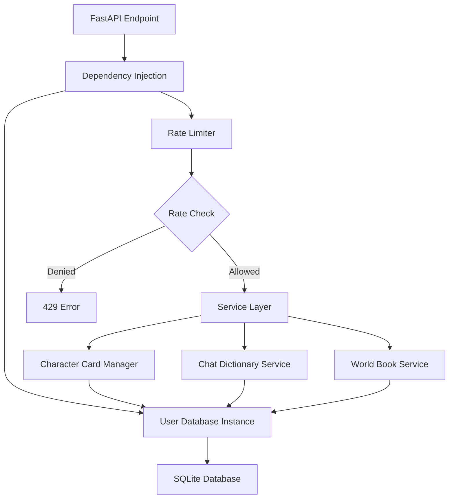

# Character Chat Module - Developer Documentation

## Table of Contents
- [Architecture Overview](#architecture-overview)
- [Module Components](#module-components)
- [Implementation Details](#implementation-details)
- [API Reference](#api-reference)
- [Integration Guide](#integration-guide)
- [Testing Strategy](#testing-strategy)
- [Performance Optimization](#performance-optimization)
- [Contributing](#contributing)

## Architecture Overview

### Design Principles

The Character Chat module follows these architectural principles:

1. **Stateless Services**: All service classes are request-scoped with no global state
2. **Database Isolation**: Per-user database instances via dependency injection
3. **Context Manager Pattern**: All database operations use context managers for proper resource cleanup
4. **Defensive Programming**: Comprehensive input validation and error handling
5. **Performance First**: Request-scoped caching, efficient queries, and batch operations

### Module Structure

```
Character_Chat/
├── character_card_manager.py    # Character CRUD and import/export
├── chat_dictionary.py           # Text transformation engine
├── world_book_manager.py        # Lorebook/context injection system
├── character_rate_limiter.py    # Rate limiting with Redis/memory fallback
└── README.md                     # This documentation
```

### Data Flow Architecture



## Module Components

### CharacterCardManager

**Purpose**: Manages character cards with V1/V2 format support and full CRUD operations.

**Key Implementation Details**:

```python
class CharacterCardManager:
    def __init__(self, db: CharactersRAGDB):
        """
        Initialize with user-specific database.
        Creates tables on init, no lazy loading.
        """
        self.db = db
        self._init_tables()  # Ensures tables exist
        self._ensure_default_character()  # Creates default if needed
```

**Critical Methods**:

1. **Import Character Card** - Auto-detects format version:
```python
def import_character_card(self, card_data: Dict[str, Any]) -> int:
    # Format detection logic
    if 'data' in card_data and 'character' in card_data['data']:
        return self._import_v2_card(card_data)
    elif 'char_name' in card_data:
        return self._import_v1_card(card_data)
    else:
        raise InputError("Unrecognized character card format")
```

2. **Database Transaction Pattern**:
```python
def create_character(self, **kwargs) -> int:
    try:
        with self.db.get_connection() as conn:
            cursor = conn.execute(
                "INSERT INTO character_cards (...) VALUES (...)",
                parameters
            )
            character_id = cursor.lastrowid
            conn.commit()
            return character_id
    except sqlite3.IntegrityError as e:
        raise ConflictError(f"Character already exists: {e}")
    except Exception as e:
        logger.error(f"Database error: {e}")
        raise CharactersRAGDBError(f"Failed to create character: {e}")
```

### ChatDictionaryService

**Purpose**: High-performance text transformation engine with pattern matching and token management.

**Architecture Highlights**:

```python
class ChatDictionaryService:
    def __init__(self, db: CharactersRAGDB):
        self.db = db
        self._init_tables()
        
        # Request-scoped caches - cleared on any write operation
        self._active_dictionaries: Optional[List[Dict]] = None
        self._active_entries: Optional[List[ChatDictionaryEntry]] = None
        self._cache_timestamp: Optional[float] = None
```

**Pattern Matching Engine**:

```python
class ChatDictionaryEntry:
    def _compile_pattern(self) -> Optional[re.Pattern]:
        """Compiles and caches regex pattern for efficient matching."""
        if self.is_regex:
            try:
                return re.compile(self.raw_key, re.IGNORECASE | re.MULTILINE)
            except re.error as e:
                logger.warning(f"Invalid regex: {e}")
                return None
        else:
            # Literal matching with word boundaries
            escaped = re.escape(self.raw_key)
            return re.compile(rf'\b{escaped}\b', re.IGNORECASE)
```

**Text Processing Pipeline**:

```python
def process_text(self, text: str, token_budget: int = 2000) -> Dict[str, Any]:
    """
    Processing stages:
    1. Load active dictionaries and entries (cached)
    2. Sort entries by priority
    3. Apply replacements with probability checks
    4. Track token usage and statistics
    5. Return processed text and metadata
    """
    # Implementation uses generator for memory efficiency
    entries = self._get_active_entries()
    
    for entry in sorted(entries, key=lambda e: e.priority, reverse=True):
        if random.random() <= (entry.probability / 100):
            text, count = entry.apply_to_text(text)
            replacements += count
            
        # Token budget check
        if self._estimate_tokens(text) > token_budget:
            break
```

### WorldBookService

**Purpose**: Context-aware content injection system with keyword matching and recursive scanning.

**Core Data Structures**:

```python
class WorldBookEntry:
    def __init__(self, ...):
        self.keywords = keywords or []
        self._patterns = self._compile_patterns()  # Pre-compiled for performance
    
    def matches(self, text: str) -> bool:
        """O(n*m) where n=patterns, m=text length. Cached patterns improve performance."""
        return any(pattern.search(text) for pattern in self._patterns)
```

**Context Processing Algorithm**:

```python
def process_context(
    self,
    text: str,
    world_book_ids: Optional[List[int]] = None,
    character_id: Optional[int] = None,
    scan_depth: int = 3,
    token_budget: int = 500,
    recursive_scanning: bool = False
) -> Tuple[str, Dict[str, Any]]:
    """
    Algorithm:
    1. Gather applicable world books (by ID or character)
    2. Load and sort entries by priority (highest first)
    3. Match entries against input text
    4. Apply recursive scanning if enabled
    5. Build injected content within token budget
    
    Complexity: O(n*m*p) where n=entries, m=text length, p=patterns per entry
    """
```

### CharacterRateLimiter

**Purpose**: Prevents abuse with configurable rate limits and dual-backend support.

**Implementation Strategy**:

```python
class CharacterRateLimiter:
    def __init__(self, redis_client: Optional[redis.Redis] = None, ...):
        self.redis = redis_client
        self.memory_store: Dict[int, List[float]] = defaultdict(list)
        
    async def check_rate_limit(self, user_id: int, operation: str) -> Tuple[bool, int]:
        """
        Uses sliding window algorithm:
        1. Remove expired entries (older than window)
        2. Count remaining entries
        3. Add new entry if under limit
        4. Set TTL on Redis key
        
        Redis operations are pipelined for efficiency.
        Falls back to in-memory storage on Redis failure.
        """
```

**Redis Pipeline for Atomic Operations**:

```python
if self.redis:
    pipe = self.redis.pipeline()
    now = time.time()
    window_start = now - self.window_seconds
    
    # Atomic operations
    pipe.zremrangebyscore(key, 0, window_start)  # Remove old
    pipe.zcard(key)                              # Count current
    pipe.zadd(key, {str(now): now})             # Add new
    pipe.expire(key, self.window_seconds)        # Set TTL
    
    results = pipe.execute()
```

## Implementation Details

### Database Connection Management

All services use the context manager pattern for database connections:

```python
with self.db.get_connection() as conn:
    cursor = conn.execute(query, params)
    result = cursor.fetchall()
    conn.commit()  # Explicit commit for writes
```

**Why**: Ensures connections are properly closed, prevents connection leaks, and provides automatic rollback on exceptions.

### Caching Strategy

Request-scoped caching pattern used throughout:

```python
def _get_active_entries(self) -> List[ChatDictionaryEntry]:
    if self._active_entries is None:
        # Load from database
        self._active_entries = self._load_active_entries()
    return self._active_entries

def _invalidate_cache(self):
    """Called after any write operation"""
    self._active_entries = None
    self._active_dictionaries = None
```

**Benefits**: Reduces database queries within a request while ensuring fresh data across requests.

### Error Handling Patterns

Consistent error handling across all services:

```python
try:
    # Operation
    with self.db.get_connection() as conn:
        result = conn.execute(query, params)
        
except sqlite3.IntegrityError as e:
    # Domain-specific error
    if "UNIQUE constraint failed" in str(e):
        raise ConflictError(f"Resource already exists: {name}")
    raise InputError(f"Invalid data: {e}")
    
except Exception as e:
    # Log and wrap unexpected errors
    logger.error(f"Unexpected error in {operation}: {e}", exc_info=True)
    raise CharactersRAGDBError(f"Operation failed: {e}")
```

### Transaction Handling

Complex operations use explicit transactions:

```python
def delete_dictionary(self, dictionary_id: int, hard_delete: bool = False):
    with self.db.get_connection() as conn:
        try:
            if hard_delete:
                # Multiple related deletes in one transaction
                conn.execute("DELETE FROM chat_dictionary_entries WHERE dictionary_id = ?", (dictionary_id,))
                conn.execute("DELETE FROM chat_dictionaries WHERE id = ?", (dictionary_id,))
            else:
                # Soft delete
                conn.execute(
                    "UPDATE chat_dictionaries SET deleted = 1, updated_at = CURRENT_TIMESTAMP WHERE id = ?",
                    (dictionary_id,)
                )
            conn.commit()
        except Exception as e:
            conn.rollback()
            raise
```

## API Reference

### CharacterCardManager API

```python
# Core Methods
create_character(name: str, description: str, **kwargs) -> int
get_character(character_id: int, include_deleted: bool = False) -> Optional[Dict]
update_character(character_id: int, **updates) -> bool
delete_character(character_id: int, hard_delete: bool = False) -> bool
list_characters(include_deleted: bool = False) -> List[Dict]

# Import/Export
import_character_card(card_data: Dict[str, Any]) -> int
export_character_card(character_id: int, version: int = 2) -> Dict[str, Any]

# Utility
search_characters(query: str) -> List[Dict]
get_character_by_name(name: str) -> Optional[Dict]
```

### ChatDictionaryService API

```python
# Dictionary Management
create_dictionary(name: str, description: Optional[str] = None) -> int
get_dictionary(dictionary_id: int) -> Optional[Dict]
update_dictionary(dictionary_id: int, **updates) -> bool
delete_dictionary(dictionary_id: int, hard_delete: bool = False) -> bool

# Entry Management
add_entry(dictionary_id: int, key: str, content: str, **kwargs) -> int
update_entry(entry_id: int, **updates) -> bool
delete_entry(entry_id: int) -> bool
get_entries(dictionary_id: int) -> List[Dict]

# Text Processing
process_text(text: str, token_budget: int = 2000, metadata: Optional[Dict] = None) -> Dict[str, Any]
# Returns: {
#     "processed_text": str,
#     "replacements": int,
#     "token_budget_exceeded": bool,
#     "dictionaries_applied": List[str],
#     "processing_time": float
# }

# Import/Export
import_from_markdown(file_path: str, dictionary_name: str) -> int
export_to_markdown(dictionary_id: int, file_path: str) -> bool

# Utilities
get_statistics() -> Dict[str, Any]
bulk_add_entries(dictionary_id: int, entries: List[Dict]) -> List[int]
clone_dictionary(source_id: int, new_name: str) -> int
```

### WorldBookService API

```python
# World Book Management
create_world_book(name: str, description: str, **kwargs) -> int
get_world_book(world_book_id: int) -> Optional[Dict]
update_world_book(world_book_id: int, **updates) -> bool
delete_world_book(world_book_id: int) -> bool

# Entry Management
add_entry(world_book_id: int, keywords: List[str], content: str, **kwargs) -> int
update_entry(entry_id: int, **updates) -> bool
delete_entry(entry_id: int) -> bool

# Character Associations
attach_to_character(character_id: int, world_book_id: int, **kwargs) -> bool
detach_from_character(character_id: int, world_book_id: int) -> bool
get_character_world_books(character_id: int) -> List[Dict]

# Context Processing
process_context(
    text: str,
    world_book_ids: Optional[List[int]] = None,
    character_id: Optional[int] = None,
    scan_depth: int = 3,
    token_budget: int = 500,
    recursive_scanning: bool = False
) -> Tuple[str, Dict[str, Any]]
# Returns: (processed_text, statistics_dict)

# Import/Export
import_world_book(data: Dict[str, Any], merge_on_conflict: bool = False) -> int
export_world_book(world_book_id: int) -> Dict[str, Any]
```

## Integration Guide

### FastAPI Endpoint Integration

```python
from fastapi import APIRouter, Depends, HTTPException, status
from tldw_Server_API.app.core.DB_Management.ChaChaNotes_DB import get_user_db
from tldw_Server_API.app.core.Character_Chat.character_card_manager import CharacterCardManager
from tldw_Server_API.app.core.Character_Chat.character_rate_limiter import get_character_rate_limiter

router = APIRouter(prefix="/api/v1/characters", tags=["characters"])

@router.post("/create")
async def create_character(
    character_data: CharacterCreateSchema,
    db: CharactersRAGDB = Depends(get_user_db),
    current_user: User = Depends(get_current_user)
):
    # Rate limiting
    limiter = get_character_rate_limiter()
    allowed, remaining = await limiter.check_rate_limit(
        user_id=current_user.id,
        operation="character_create"
    )
    
    if not allowed:
        raise HTTPException(
            status_code=status.HTTP_429_TOO_MANY_REQUESTS,
            detail="Rate limit exceeded"
        )
    
    # Create character
    manager = CharacterCardManager(db)
    try:
        character_id = manager.create_character(**character_data.dict())
        return {"id": character_id, "remaining_operations": remaining}
    except ConflictError as e:
        raise HTTPException(status_code=status.HTTP_409_CONFLICT, detail=str(e))
    except InputError as e:
        raise HTTPException(status_code=status.HTTP_400_BAD_REQUEST, detail=str(e))
```

### Dependency Injection Setup

```python
# dependencies.py
from functools import lru_cache

@lru_cache()
def get_character_settings():
    return {
        "max_characters": settings.MAX_CHARACTERS_PER_USER,
        "rate_limit_ops": settings.CHARACTER_RATE_LIMIT_OPS,
        "rate_limit_window": settings.CHARACTER_RATE_LIMIT_WINDOW
    }

def get_character_manager(
    db: CharactersRAGDB = Depends(get_user_db)
) -> CharacterCardManager:
    """Factory for request-scoped character manager."""
    return CharacterCardManager(db)

def get_dictionary_service(
    db: CharactersRAGDB = Depends(get_user_db)
) -> ChatDictionaryService:
    """Factory for request-scoped dictionary service."""
    return ChatDictionaryService(db)
```

### Background Task Integration

```python
from fastapi import BackgroundTasks

@router.post("/import")
async def import_character(
    file: UploadFile,
    background_tasks: BackgroundTasks,
    manager: CharacterCardManager = Depends(get_character_manager)
):
    # Parse file
    content = await file.read()
    card_data = json.loads(content)
    
    # Import character
    character_id = manager.import_character_card(card_data)
    
    # Queue background processing
    background_tasks.add_task(
        process_character_embeddings,
        character_id=character_id,
        manager=manager
    )
    
    return {"id": character_id, "status": "imported"}
```

## Testing Strategy

### Unit Testing Patterns

```python
import pytest
from unittest.mock import MagicMock, patch

@pytest.fixture
def mock_db():
    """Create properly mocked database with context manager."""
    mock = MagicMock()
    
    # Setup connection context manager
    mock_conn = MagicMock()
    mock_cursor = MagicMock()
    mock_cursor.lastrowid = 1
    mock_cursor.fetchall.return_value = []
    mock_conn.execute.return_value = mock_cursor
    
    mock_ctx = MagicMock()
    mock_ctx.__enter__ = MagicMock(return_value=mock_conn)
    mock_ctx.__exit__ = MagicMock(return_value=None)
    mock.get_connection.return_value = mock_ctx
    
    return mock

def test_create_character(mock_db):
    manager = CharacterCardManager(mock_db)
    
    # Reset mock from __init__ calls
    mock_conn = mock_db.get_connection().__enter__()
    mock_conn.execute.reset_mock()
    
    character_id = manager.create_character(
        name="Test Character",
        description="Test description"
    )
    
    assert character_id == 1
    mock_conn.execute.assert_called_once()
    call_args = mock_conn.execute.call_args[0]
    assert "INSERT INTO character_cards" in call_args[0]
```

### Integration Testing

```python
@pytest.mark.integration
def test_full_character_lifecycle(test_db):
    """Test complete character lifecycle with real database."""
    manager = CharacterCardManager(test_db)
    
    # Create
    char_id = manager.create_character(name="Test", description="Desc")
    assert char_id > 0
    
    # Read
    character = manager.get_character(char_id)
    assert character["name"] == "Test"
    
    # Update
    manager.update_character(char_id, description="New desc")
    character = manager.get_character(char_id)
    assert character["description"] == "New desc"
    
    # Delete
    manager.delete_character(char_id)
    character = manager.get_character(char_id)
    assert character is None
```

### Performance Testing

```python
@pytest.mark.performance
def test_dictionary_processing_performance(service, large_dictionary):
    """Ensure text processing meets performance requirements."""
    import time
    
    text = "Large text " * 1000  # ~4000 words
    
    start = time.time()
    result = service.process_text(text, token_budget=2000)
    elapsed = time.time() - start
    
    assert elapsed < 0.5  # Must process in under 500ms
    assert result["token_budget_exceeded"] is False
```

## Performance Optimization

### Query Optimization

1. **Indexed Columns**: All foreign keys and commonly queried fields are indexed:
```sql
CREATE INDEX idx_dict_entries_dictionary_id ON chat_dictionary_entries(dictionary_id);
CREATE INDEX idx_dict_entries_priority ON chat_dictionary_entries(priority DESC);
CREATE INDEX idx_char_cards_user_id ON character_cards(user_id);
```

2. **Batch Operations**: Use `executemany` for bulk inserts:
```python
def bulk_add_entries(self, dictionary_id: int, entries: List[Dict]) -> List[int]:
    with self.db.get_connection() as conn:
        cursor = conn.executemany(
            "INSERT INTO chat_dictionary_entries (...) VALUES (...)",
            [self._prepare_entry(e) for e in entries]
        )
        conn.commit()
```

3. **Query Planning**: Use EXPLAIN QUERY PLAN in development:
```python
if settings.DEBUG:
    cursor = conn.execute(f"EXPLAIN QUERY PLAN {query}", params)
    logger.debug(f"Query plan: {cursor.fetchall()}")
```

### Memory Management

1. **Generator Usage**: For large result sets:
```python
def iterate_entries(self, dictionary_id: int):
    with self.db.get_connection() as conn:
        cursor = conn.execute(
            "SELECT * FROM chat_dictionary_entries WHERE dictionary_id = ?",
            (dictionary_id,)
        )
        while row := cursor.fetchone():
            yield ChatDictionaryEntry.from_dict(dict(row))
```

2. **Lazy Loading**: Load data only when needed:
```python
@property
def entries(self):
    if self._entries is None:
        self._entries = self._load_entries()
    return self._entries
```

### Caching Strategies

1. **Request-Scoped Caching**: Prevents redundant queries within a request
2. **Pre-compiled Patterns**: Regex patterns compiled once and reused
3. **Connection Pooling**: Reuse database connections (handled by SQLite)

## Contributing

### Code Style Guidelines

1. **Type Hints**: All functions must have type hints:
```python
def process_text(
    self,
    text: str,
    token_budget: int = 2000,
    metadata: Optional[Dict[str, Any]] = None
) -> Dict[str, Any]:
```

2. **Docstrings**: Use Google-style docstrings:
```python
def create_character(self, name: str, description: str) -> int:
    """
    Create a new character card.
    
    Args:
        name: Character name (must be unique)
        description: Character description
        
    Returns:
        The ID of the created character
        
    Raises:
        ConflictError: If character name already exists
        InputError: If input validation fails
    """
```

3. **Error Handling**: Always catch specific exceptions first
4. **Logging**: Use structured logging with context:
```python
logger.info(
    "Character created",
    character_id=character_id,
    name=name,
    user_id=self.db.user_id
)
```

### Testing Requirements

- All new features must include unit tests
- Integration tests for database operations
- Mock external dependencies (Redis, etc.)
- Maintain >80% code coverage
- Performance tests for critical paths

### Pull Request Checklist

- [ ] Code follows style guidelines
- [ ] All tests pass
- [ ] Documentation updated
- [ ] Performance impact assessed
- [ ] Database migrations included (if needed)
- [ ] Backwards compatibility maintained

## Troubleshooting

### Common Issues and Solutions

1. **Database Locked Errors**
   - Cause: Concurrent writes to SQLite
   - Solution: Implement retry logic with exponential backoff
   ```python
   @retry(stop=stop_after_attempt(3), wait=wait_exponential(multiplier=1, min=1, max=5))
   def write_with_retry(self, query, params):
       with self.db.get_connection() as conn:
           return conn.execute(query, params)
   ```

2. **Memory Leaks in Long-Running Processes**
   - Cause: Cache not being cleared
   - Solution: Implement cache TTL or size limits
   ```python
   def _check_cache_validity(self):
       if time.time() - self._cache_timestamp > 300:  # 5 minutes
           self._invalidate_cache()
   ```

3. **Slow Text Processing**
   - Cause: Too many active dictionaries/entries
   - Solution: Implement priority-based loading and pagination

4. **Rate Limit Redis Failures**
   - Cause: Redis connection issues
   - Solution: Automatic fallback to in-memory storage (already implemented)

### Debug Logging

Enable detailed logging for troubleshooting:

```python
# In your application startup
from loguru import logger

logger.add(
    "character_chat_debug.log",
    level="DEBUG",
    filter=lambda record: record["name"].startswith("tldw_Server_API.app.core.Character_Chat"),
    rotation="10 MB"
)
```

## Future Roadmap

### Planned Enhancements

1. **Performance**
   - Implement read replicas for scaling
   - Add query result caching with Redis
   - Optimize pattern matching with Aho-Corasick algorithm

2. **Features**
   - Conversation history management
   - Character relationship graphs
   - Advanced conditional world book entries
   - Real-time collaborative editing

3. **Architecture**
   - Event-driven updates via message queue
   - Microservice extraction for scaling
   - GraphQL API layer

### Breaking Changes Policy

- Deprecated features maintained for 2 versions
- Database migrations provided for schema changes
- Clear upgrade paths documented
- Semantic versioning strictly followed

## Support

For development support:
- Review test files for implementation examples
- Check docstrings and type hints
- Enable debug logging for detailed traces
- Profile with cProfile for performance issues

For architectural questions:
- Consult this documentation
- Review the design patterns in existing code
- Check commit history for decision rationale
- Open a discussion in the repository